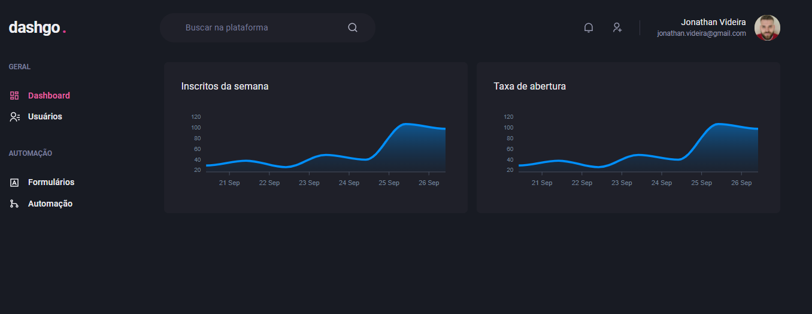

<h1 align="center">DashGO</h1>
<h2 align="center">Rocketseat - Ignite - ReactJS</h2>

<h3 align="center">Chapter #4</h3>

  <a href="#-Project">Project</a>&nbsp;&nbsp;&nbsp;|&nbsp;&nbsp;&nbsp;
  <a href="#-Technologies">Technologies</a>&nbsp;&nbsp;&nbsp;|&nbsp;&nbsp;&nbsp;
  <a href="#-How-to-execute">How to execute</a>&nbsp;&nbsp;&nbsp;|&nbsp;&nbsp;&nbsp;
  <a href="#-Licence">Licence</a>

  

 
 

## 💻 Project

This is the Fourth project of ReactJS track of Ignite course from [Rocketseat](https://rocketseat.com.br/).

## ✨ Technologies

This project was developed with the technologies above:

- [React](https://reactjs.org)
- [TypeScript](https://www.typescriptlang.org)
- [NextJS](https://nextjs.org)
- [Chakra UI](https://chakra-ui.com)
- [Emotion](https://emotion.sh)
- [Framer Motion](https://framer.com/motion)
- [react-icons](https://react-icons.github.io/react-icons)
- [ApexCharts](https://apexcharts.com)
- [react-hook-form](https://react-hook-form.com)
- [yup](https://github.com/jquense/yup)
- [react-query](https://react-query.tanstack.com/)
- [miragejs](https://miragejs.com)
- [faker](http://marak.github.io/faker.js)

## 🚀 How to execute

- Clone the repository
- Install de dependencies with `yarn`
- Run the application with `yarn dev`
- Access [`localhost:3000`](http://localhost:3000) in your browser

## 📄 Licence

This project is under the MIT license. See the [LICENSE](./LICENSE) file for more details.

---

Made with ♥ by Jonathan Alba Videira and Rocketseat
